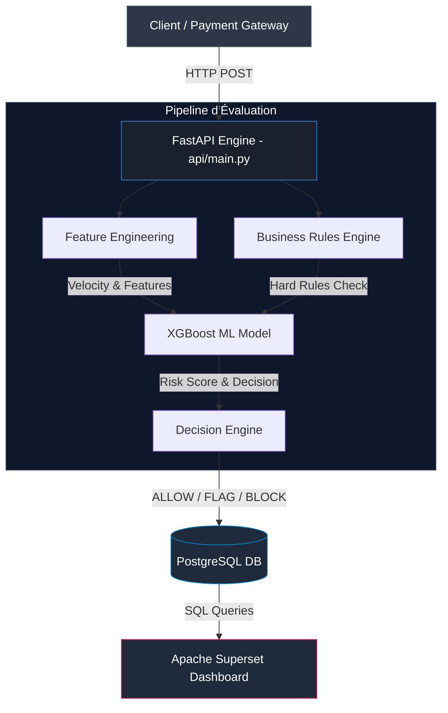

# 🛡️ NeoShield Analytics — Real-Time Credit Card Fraud Detection & Analytics Platform


**NeoShield Analytics** est une plateforme de détection de fraude et d'évaluation du risque appliquée aux transactions par carte bancaire.

Le projet combine **Machine Learning**, **règles métier**, **feature engineering**, **analyse géographique**, **persistance PostgreSQL** et **Business Intelligence** afin de simuler un système de détection de fraude en temps réel.

Le moteur de scoring repose sur un modèle **XGBoost**, complété par un moteur de règles permettant de prendre une décision finale :

* `ALLOW` — transaction autorisée
* `FLAG` — transaction signalée pour analyse
* `BLOCK` — transaction bloquée

---

## 📐 Architecture & Pipeline



### 🔄 Pipeline de traitement

1. Une transaction est envoyée à l'API **FastAPI**.
2. Les données sont préparées et transformées par le module de **Feature Engineering**.
3. Le système vérifie différentes **règles métier**.
4. Le modèle **XGBoost** produit un score de risque.
5. Le **Decision Engine** combine le score ML et les règles métier.
6. Une décision `ALLOW`, `FLAG` ou `BLOCK` est générée.
7. La transaction et son résultat sont enregistrés dans **PostgreSQL**.
8. Les données sont exploitées dans **Apache Superset** pour le suivi analytique.

---

## 📊 Dashboard & Monitoring

Le suivi des métriques clés de performance (KPIs) et des transactions est réalisé avec **Apache Superset**, déployé via Docker.

### Aperçu du Dashboard

Une capture du dashboard est disponible dans :


```text
docs/imgaes/dashboard_superset.png
```

Vous pouvez également l'afficher directement dans GitHub avec :

```markdown

```

### 📈 Indicateurs visualisés

* **Fraud Rate** : proportion de transactions identifiées comme frauduleuses.
* **Transaction Volume** : évolution du nombre de transactions dans le temps.
* **Transaction Amount** : évolution des montants traités.
* **ALLOW / FLAG / BLOCK Distribution** : répartition des décisions du moteur.
* **Risk Score Distribution** : distribution des scores générés par le modèle XGBoost.
* **Geographical Risk** : analyse du risque par pays.
* **Merchant Category Risk** : analyse du risque par catégorie de marchand.
* **High-Risk Transactions** : identification des transactions présentant des caractéristiques suspectes.

---

## ✨ Fonctionnalités clés

### 🤖 Scoring Machine Learning en temps réel

Le système utilise un modèle **XGBoost** pour estimer la probabilité qu'une transaction soit frauduleuse.

Le modèle produit un score de risque compris entre `0` et `1`.

Exemple :

```text
0.05 → Risque faible
0.35 → Risque modéré
0.70 → Risque élevé
0.90 → Risque très élevé
```

---

### 🧮 Feature Engineering dynamique

Le système transforme les données brutes d'une transaction en variables exploitables par le modèle.

Exemples :

* montant de la transaction
* pays du marchand
* catégorie du marchand
* statut KYC
* coordonnées géographiques
* historique de transactions
* vitesse géographique
* indicateurs de risque

---

### ⚙️ Moteur de décision hybride

NeoShield combine deux approches :

**Machine Learning**

```text
Transaction → XGBoost → Risk Score
```

et **règles métier**

```text
Transaction → Business Rules → Triggered Rules
```

Ces informations sont ensuite utilisées par le moteur de décision.

Exemples de règles :

```text
HIGH_RISK_COUNTRY
SUSPICIOUS_MERCHANT_CATEGORY
HIGH_AMOUNT_TRANSACTION
```

Cette approche permet de combiner la capacité prédictive du Machine Learning avec des règles métier explicites.

---

### 🌍 Geographical Velocity Checks

Le système peut analyser la cohérence géographique des transactions.

Par exemple :

```text
Transaction 1
Montreal, Canada
10:00

        ↓

Transaction 2
London, United Kingdom
10:05
```

Un déplacement physique aussi rapide peut être considéré comme suspect et contribuer à l'augmentation du niveau de risque.

---

### 🗄️ Persistance PostgreSQL

Chaque transaction évaluée est enregistrée dans PostgreSQL avec notamment :

* identifiant de transaction
* identifiant de carte
* montant
* devise
* pays du marchand
* catégorie du marchand
* score de risque
* décision
* règles déclenchées
* timestamp
* indicateur de fraude

Exemple d'identifiant :

```text
TX_API_a1b2c3d4
```

---

### 📊 Business Intelligence

Apache Superset est connecté directement à PostgreSQL afin de permettre :

* l'analyse des transactions
* le suivi des KPIs
* l'analyse des risques
* la visualisation des tendances
* l'exploration des données
* le monitoring des décisions `ALLOW`, `FLAG` et `BLOCK`

---

# 📁 Structure du projet

```text
neoshield-analytics/
│
├── api/
│   └── main.py
│       # Service Web FastAPI
│       # Endpoints API
│       # Connexion à PostgreSQL
│       # Pipeline d'évaluation
│
├── docs/
│   └── dashboard_screenshot.png
│       # Capture du dashboard Apache Superset
│
├── ml_models/
│   └── fraud_detector_model.pkl
│       # Modèle XGBoost entraîné
│
├── scripts/
│   ├── train_model.py
│   │   # Entraînement du modèle ML
│   │
│   └── seed_db.py
│       # Initialisation / alimentation de PostgreSQL
│
├── requirements.txt
│   # Dépendances Python
│
├── .env.example
│   # Exemple de configuration
│
└── README.md
    # Documentation du projet
```

---

# 🛠️ Stack technique

| Technologie         | Utilisation                           |
| ------------------- | ------------------------------------- |
| **Python 3.10+**    | Langage principal                     |
| **FastAPI**         | API REST                              |
| **Uvicorn**         | Serveur ASGI                          |
| **Pydantic**        | Validation des données                |
| **XGBoost**         | Modèle Machine Learning               |
| **Scikit-Learn**    | Machine Learning / preprocessing      |
| **Pandas**          | Manipulation des données              |
| **Joblib**          | Sauvegarde / chargement du modèle     |
| **PostgreSQL**      | Base de données                       |
| **Psycopg2**        | Connexion PostgreSQL                  |
| **Apache Superset** | Business Intelligence                 |
| **Docker**          | Déploiement de Superset               |
| **Python-dotenv**   | Gestion des variables d'environnement |

---

# 🚀 Installation & démarrage

## 1. Prérequis

Avant de commencer, assurez-vous d'avoir installé :

* Python 3.10 ou supérieur
* PostgreSQL 15 ou supérieur
* Docker
* Git

---

## 2. Cloner le dépôt

```bash
git clone https://github.com/Jadelktini/neoshield-analytics.git

cd neoshield-analytics
```

---

## 3. Créer un environnement virtuel

### Linux / macOS

```bash
python3 -m venv venv

source venv/bin/activate
```

### Windows

```bash
python -m venv venv

venv\Scripts\activate
```

---

## 4. Installer les dépendances

```bash
pip install -r requirements.txt
```

---

# 🔐 Configuration

Créez un fichier `.env` à la racine du projet en vous basant sur `.env.example`.

Exemple :

```env
DB_HOST=localhost
DB_PORT=5432
DB_NAME=neoshield_fraud
DB_USER=analyst_user
DB_PASS=votre_mot_de_passe
```

> ⚠️ Ne committez jamais votre véritable fichier `.env` contenant des identifiants ou mots de passe.

---

# 🗄️ Initialiser la base de données

Si nécessaire, utilisez le script fourni pour initialiser et alimenter la base :

```bash
python scripts/seed_db.py
```

Assurez-vous que PostgreSQL est démarré et que les informations de connexion du fichier `.env` sont correctes.

---

# 🤖 Entraîner le modèle

Le modèle XGBoost peut être entraîné avec :

```bash
python scripts/train_model.py
```

Le modèle entraîné est sauvegardé dans :

```text
ml_models/fraud_detector_model.pkl
```

---

# 🚀 Lancer l'API FastAPI

Démarrez l'application avec :

```bash
python -m uvicorn api.main:app --reload --port 8000
```

L'API sera disponible à :

```text
http://localhost:8000
```

### Documentation Swagger

FastAPI fournit automatiquement une documentation interactive :

```text
http://localhost:8000/docs
```

---

# 🐳 Lancer Apache Superset

Apache Superset peut être lancé via Docker :

```bash
docker run -d \
  -p 8088:8088 \
  --name superset \
  apache/superset
```

Superset sera ensuite accessible à :

```text
http://localhost:8088
```

Une fois Superset lancé :

1. Connectez PostgreSQL comme source de données.
2. Sélectionnez la base `neoshield_fraud`.
3. Sélectionnez la table des transactions.
4. Créez les visualisations nécessaires.
5. Assemblez-les dans le dashboard NeoShield.

---

# 📬 Utilisation de l'API

## Endpoint

```text
POST /api/v1/transactions/evaluate
```

---

## Exemple de requête

```bash
curl -X POST \
  "http://localhost:8000/api/v1/transactions/evaluate" \
  -H "Content-Type: application/json" \
  -d '{
    "user_id": 101,
    "card_id": 1234,
    "amount": 1250.00,
    "currency": "EUR",
    "merchant_category": "crypto",
    "merchant_country": "KY",
    "kyc_status": "verified",
    "lat": 45.5017,
    "lon": -73.5673
  }'
```

---

# 📤 Exemple de réponse

```json
{
  "status": "success",
  "transaction_id": "TX_API_a1b2c3d4",
  "action": "BLOCK",
  "risk_score": 0.8924,
  "triggered_rules": [
    "HIGH_RISK_COUNTRY",
    "SUSPICIOUS_MERCHANT_CATEGORY"
  ],
  "evaluated_at": "2026-09-15T15:30:00.123456"
}
```

---

# 🧠 Interprétation du résultat

Dans cet exemple :

```text
Risk Score = 0.8924
```

Le système considère la transaction comme présentant un niveau de risque élevé.

Deux règles métier ont également été déclenchées :

```text
HIGH_RISK_COUNTRY
SUSPICIOUS_MERCHANT_CATEGORY
```

Le moteur de décision produit donc :

```text
BLOCK
```

---

# 🔍 Vérification dans PostgreSQL

Pour vérifier les dernières transactions enregistrées :

```sql
SELECT
    transaction_id,
    card_id,
    amount,
    merchant_country,
    merchant_category,
    is_fraud,
    timestamp
FROM transactions
ORDER BY timestamp DESC
LIMIT 5;
```

---

# 🔎 Exemple de flux complet

```text
                    Transaction
                         │
                         ▼
                ┌─────────────────┐
                │   FastAPI API   │
                └────────┬────────┘
                         │
             ┌───────────┴───────────┐
             ▼                       ▼
    Feature Engineering       Business Rules
             │                       │
             ▼                       ▼
       XGBoost Model          Rule Evaluation
             │                       │
             └───────────┬───────────┘
                         ▼
                 Decision Engine
                         │
              ┌──────────┼──────────┐
              ▼          ▼          ▼
           ALLOW        FLAG       BLOCK
              │          │          │
              └──────────┼──────────┘
                         ▼
                  PostgreSQL
                         │
                         ▼
                 Apache Superset
                         │
                         ▼
                 Analytics / KPIs
```

---

# 🎯 Objectifs du projet

NeoShield Analytics a été conçu comme un projet permettant de mettre en pratique plusieurs domaines de la Data et de l'AI :

* Machine Learning
* Fraud Detection
* Feature Engineering
* REST API
* Data Engineering
* PostgreSQL
* Business Intelligence
* Data Visualization
* Rule-Based Systems
* Real-Time Risk Scoring
* Docker
* Model Deployment

L'objectif est de démontrer comment ces composants peuvent être intégrés dans une architecture cohérente de détection de fraude.

---

# 🔮 Améliorations futures

Plusieurs évolutions peuvent être ajoutées au projet :

### Machine Learning

* amélioration du modèle XGBoost
* hyperparameter tuning
* gestion du déséquilibre des classes
* comparaison avec d'autres modèles
* calibration du score de risque
* monitoring de la performance du modèle
* détection du model drift

### Data Engineering

* ingestion de transactions en streaming
* Apache Kafka
* pipeline ETL/ELT
* feature store
* data quality checks
* data validation

### Fraud Detection

* analyse comportementale des utilisateurs
* historique des transactions
* détection d'anomalies
* graph-based fraud detection
* device fingerprinting
* analyse de vélocité avancée

### API & Infrastructure

* authentification API
* Dockerisation complète
* Docker Compose
* CI/CD
* tests automatisés
* logging centralisé
* monitoring

### Business Intelligence

* dashboards plus avancés
* alertes automatiques
* analyse temporelle
* segmentation des utilisateurs
* suivi des performances du modèle
* reporting fraude

---

# 🔒 Sécurité

Ce projet est conçu à des fins **éducatives et de démonstration**.

Les données utilisées ne doivent pas contenir de véritables informations bancaires sensibles.

En environnement de production, des mécanismes supplémentaires seraient nécessaires, notamment :

* chiffrement des données
* gestion sécurisée des secrets
* authentification et autorisation
* contrôle des accès
* audit logging
* protection des données personnelles
* conformité réglementaire
* monitoring de sécurité

---

# 📌 Disclaimer

**NeoShield Analytics est un projet de démonstration et ne constitue pas un système bancaire ou antifraude destiné à la production.**

Les scores et décisions produits par le système sont destinés à illustrer une architecture de détection de fraude combinant Machine Learning et règles métier.

---

# 👨‍💻 Author

**Jadelktini**

GitHub:

https://github.com/Jadelktini

---

⭐ If you find this project interesting, feel free to explore the repository and experiment with the architecture.
